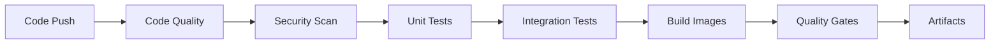
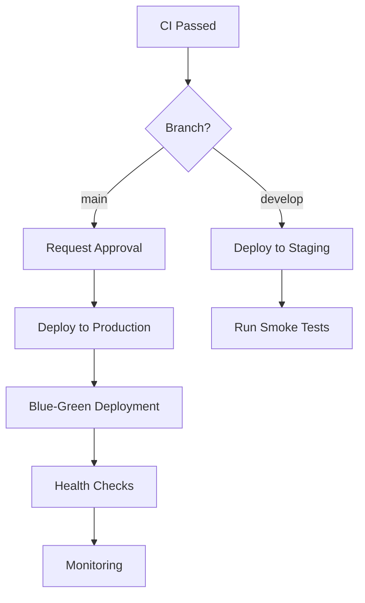

# CI/CD Pipeline Documentation

This directory contains the complete CI/CD automation setup for the SuiteCRM COBOL Bridge project.

## 🚀 Overview

The CI/CD pipeline is designed to provide comprehensive automation for:
- **Continuous Integration**: Build, test, lint, and security scanning
- **Continuous Deployment**: Automated deployments to staging and production
- **Quality Assurance**: Code quality gates and performance monitoring
- **Security**: Container and dependency vulnerability scanning
- **Release Management**: Semantic versioning, changelog, and release notes

## 📁 Pipeline Structure

### GitHub Actions Workflows

| Workflow | Purpose | Trigger |
|----------|---------|---------|
| [`ci.yml`](workflows/ci.yml) | Continuous Integration | Push, PR |
| [`cd.yml`](workflows/cd.yml) | Continuous Deployment | CI completion, manual |
| [`container-security.yml`](workflows/container-security.yml) | Container Security Scanning | Push, Schedule |
| [`code-quality.yml`](workflows/code-quality.yml) | Code Quality & Coverage Analysis | Push, PR |
| [`performance-testing.yml`](workflows/performance-testing.yml) | Performance Regression Tests | Push, PR, Schedule |
| [`quality-gates.yml`](workflows/quality-gates.yml) | Quality Gates Enforcement | Push, PR |
| [`semantic-versioning.yml`](workflows/semantic-versioning.yml) | Automated Versioning & Releases | Push to main |
| [`production-approval.yml`](workflows/production-approval.yml) | Production Deployment Approval | Workflow call |

### Automation Scripts

| Script | Purpose | Usage |
|--------|---------|-------|
| [`scripts/build-and-push.sh`](../scripts/build-and-push.sh) | Docker image building and registry push | `./scripts/build-and-push.sh --version=1.2.3` |
| [`scripts/blue-green-deploy.sh`](../scripts/blue-green-deploy.sh) | Blue-green deployment automation | `./scripts/blue-green-deploy.sh --version=1.2.3` |
| [`scripts/migrate-database.sh`](../scripts/migrate-database.sh) | Database migration automation | `./scripts/migrate-database.sh migrate` |
| [`scripts/config-manager.sh`](../scripts/config-manager.sh) | Configuration management | `./scripts/config-manager.sh generate` |
| [`scripts/generate-release-notes.sh`](../scripts/generate-release-notes.sh) | Release notes generation | `./scripts/generate-release-notes.sh 1.2.3` |
| [`scripts/maintain-changelog.sh`](../scripts/maintain-changelog.sh) | Changelog maintenance | `./scripts/maintain-changelog.sh add Fixed "Bug fix"` |

## 🔄 Pipeline Workflow

### 1. Continuous Integration (CI)

**Triggers**: Push to any branch, Pull Request to main/develop

**Process**:


**Components**:
- **Code Quality**: ESLint, PHPStan, formatting checks
- **Security Scanning**: npm audit, Snyk, CodeQL
- **Testing**: Unit tests (Jest, PHPUnit), Integration tests (Playwright)
- **Build**: Multi-platform Docker images
- **Quality Gates**: Coverage, security, performance thresholds

### 2. Continuous Deployment (CD)

**Triggers**: CI completion, Manual deployment

**Process**:


**Environments**:
- **Staging**: Automatic deployment from `develop` branch
- **Production**: Manual approval required, blue-green deployment

### 3. Quality Gates

**Thresholds**:
- **Code Coverage**: ≥ 80%
- **Security**: 0 critical, ≤ 5 high vulnerabilities
- **Performance**: P95 ≤ 500ms, Error rate ≤ 1%
- **Maintainability**: Index ≥ 60

### 4. Release Management

**Process**:
- **Semantic Versioning**: Automatic version bumping based on conventional commits
- **Release Notes**: Auto-generated from commit messages
- **Changelog**: Maintained in Keep a Changelog format
- **Artifacts**: Source code, binaries, Docker images

## 🛡️ Security

### Container Security
- **Hadolint**: Dockerfile security linting
- **Trivy**: Vulnerability scanning
- **Grype**: Additional vulnerability detection  
- **Snyk**: Container security monitoring
- **Docker Bench**: Security best practices

### Code Security
- **CodeQL**: Static code analysis
- **npm audit**: Dependency vulnerability scanning
- **Snyk**: Real-time vulnerability monitoring
- **SARIF**: Security results integration

### Runtime Security
- **Falco**: Runtime behavior monitoring
- **Security policies**: Kubernetes security constraints

## 📊 Monitoring & Observability

### Performance Testing
- **Artillery**: Load testing and performance benchmarks
- **K6**: Scalability and stress testing
- **Lighthouse**: Frontend performance auditing
- **Baseline Comparison**: Performance regression detection

### Metrics & Alerting
- **Prometheus**: Metrics collection
- **Grafana**: Dashboards and visualization
- **Slack**: Real-time notifications
- **GitHub Issues**: Automated issue creation for regressions

## 🔧 Configuration

### Environment Variables

#### CI/CD Configuration
```bash
# Registry
REGISTRY=ghcr.io
IMAGE_NAME=suitecrm-cobol-bridge

# Quality Thresholds
PERFORMANCE_THRESHOLD_P95=500
PERFORMANCE_THRESHOLD_ERROR_RATE=1
PERFORMANCE_THRESHOLD_THROUGHPUT=100

# Security
SNYK_TOKEN=<snyk-token>
SONAR_TOKEN=<sonarqube-token>
```

#### Deployment Configuration
```bash
# AWS
AWS_ACCESS_KEY_ID=<aws-key>
AWS_SECRET_ACCESS_KEY=<aws-secret>
AWS_REGION=us-east-1

# Database
DB_HOST=<db-host>
DB_PASSWORD=<db-password>

# Monitoring
SLACK_WEBHOOK=<slack-webhook>
```

### GitHub Environments

#### Required Environments
- `staging`: Automatic deployment environment
- `production-approval`: Manual approval for production
- `production-high-risk`: High-risk deployment approval
- `production-emergency`: Emergency deployment approval

#### Environment Protection Rules
- **Staging**: No restrictions
- **Production**: Require reviewers, wait timer
- **High-Risk**: Multiple reviewers required
- **Emergency**: Single reviewer, reduced wait time

## 🚦 Quality Gates Details

### Coverage Gate
- **Requirement**: ≥ 80% line coverage
- **Components**: JavaScript (Jest), PHP (PHPUnit), Integration tests
- **Reporting**: Codecov integration, PR comments

### Security Gate
- **Critical Vulnerabilities**: 0 allowed
- **High Vulnerabilities**: ≤ 5 allowed
- **Tools**: npm audit, Snyk, Trivy, CodeQL
- **Action**: Block deployment if thresholds exceeded

### Performance Gate
- **Response Time**: P95 ≤ 500ms
- **Error Rate**: ≤ 1%
- **Throughput**: ≥ 100 RPS
- **Frontend**: Lighthouse score ≥ 0.8
- **Action**: Alert and optionally block deployment

### Code Quality Gate
- **Maintainability Index**: ≥ 60
- **Code Duplication**: ≤ 10%
- **Complexity**: Monitored and reported
- **Linting**: Zero errors allowed

## 🔄 Deployment Strategies

### Blue-Green Deployment

**Process**:
1. Deploy new version to inactive environment (Blue/Green)
2. Run health checks and smoke tests
3. Switch traffic to new environment
4. Monitor for issues (5-minute window)
5. Keep old environment as rollback option
6. Scale down old environment after success

**Benefits**:
- Zero-downtime deployments
- Instant rollback capability
- Production testing before traffic switch
- Reduced deployment risk

### Database Migrations

**Process**:
1. Backup current database
2. Apply migrations in transaction
3. Verify migration success
4. Record migration history
5. Rollback support for failures

**Features**:
- Automatic backup creation
- Migration versioning
- Rollback scripts
- History tracking
- Dry-run capability

## 📈 Performance Testing

### Load Testing (Artillery)
- **Scenarios**: API endpoints, COBOL execution, UI interactions
- **Metrics**: Response time, throughput, error rate
- **Thresholds**: P95 < 500ms, Error rate < 1%
- **Reporting**: HTML reports, metrics export

### Browser Testing (Lighthouse) 
- **Metrics**: Performance, Accessibility, Best Practices, SEO
- **Thresholds**: Performance ≥ 0.8, Accessibility ≥ 0.9
- **Pages**: Main app, monitoring, business rules
- **CI Integration**: Automated checks on every deployment

### Stress Testing (K6)
- **Scenarios**: Gradual load increase, spike testing
- **Users**: Up to 50 concurrent users
- **Duration**: Configurable (default 10 minutes)
- **Failure Conditions**: Automatic test failure on threshold breach

## 🎯 Best Practices

### Commit Messages
Use [Conventional Commits](https://www.conventionalcommits.org/) for automatic versioning:

```
feat: add user authentication system
fix: resolve database connection timeout  
docs: update API documentation
BREAKING CHANGE: change API response format
```

### Branch Strategy
- `main`: Production releases only
- `develop`: Integration branch for features
- `feature/*`: Feature development branches
- `hotfix/*`: Emergency production fixes
- `release/*`: Release preparation branches

### Code Review
- All changes require PR approval
- Automated tests must pass
- Quality gates must be satisfied
- Security scans must be clean

### Deployment
- Staging deployment is automatic from `develop`
- Production deployment requires manual approval
- High-risk changes need additional approval
- Emergency deployments have expedited process

## 🆘 Troubleshooting

### Common Issues

#### CI Failures
- **Test Failures**: Check logs, run tests locally
- **Build Failures**: Verify dependencies, check Dockerfile
- **Security Issues**: Review audit reports, update dependencies
- **Quality Gates**: Check coverage, fix linting errors

#### Deployment Issues
- **Health Check Failures**: Verify service startup, check configuration
- **Migration Failures**: Review migration scripts, check database state
- **Approval Delays**: Contact approvers, check Slack notifications
- **Rollback Needs**: Use blue-green rollback, restore from backup

#### Performance Issues
- **Slow Response Times**: Check resource usage, optimize queries
- **High Error Rates**: Review logs, check dependencies
- **Lighthouse Failures**: Optimize assets, improve accessibility
- **Load Test Failures**: Scale resources, optimize code

### Support Contacts
- **DevOps Team**: @devops-team
- **Security Team**: @security-team  
- **Development Team**: @dev-team
- **On-Call**: See incident response playbook

## 📚 Additional Resources

- [Docker Documentation](https://docs.docker.com/)
- [Kubernetes Documentation](https://kubernetes.io/docs/)
- [GitHub Actions Documentation](https://docs.github.com/en/actions)
- [Conventional Commits](https://www.conventionalcommits.org/)
- [Keep a Changelog](https://keepachangelog.com/)
- [Semantic Versioning](https://semver.org/)

## 🤝 Contributing

To contribute to the CI/CD pipeline:

1. Create a feature branch from `develop`
2. Make your changes with appropriate tests
3. Update documentation if needed
4. Submit a pull request
5. Ensure all quality gates pass
6. Request review from DevOps team

---

*This documentation is automatically updated with each release. Last updated: $(date -u +'%Y-%m-%d %H:%M:%S UTC')*